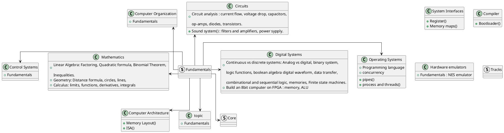
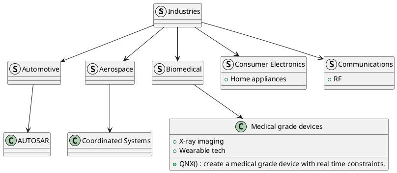

# Chapter 1

```plantuml,format=svg
@startuml
'skinparam linetype polyline
skinparam linetype ortho

struct Fundamentals {

}


class "Mathematics" as math {
   + Linear Algebra: Factoring, Quadratic formula, Binomial Theorem, \n
   Inequalities.
   + Geometry: Distance formula, circles, lines,
   + Calculus: limits, functions, derivatives, integrals

}

class "Digital Systems" as digital_sys {
  + Continuous vs discrete systems: Analog vs digital, binary system, \n
   logic functions, boolean algebra digital waveform, data transfer, \n
   combinational and sequential logic, memories, Finite state machines.
  + Build an 8bit computer on FPGA : memory, ALU

}

class "Control Systems" as control_sys {
  + Fundamentals

}

class "Computer Organization" as computer_org {
  + Fundamentals

}

class "Computer Architecture" as comp_arch {
   + Memory Layout()
   + ISA()
}

class "Operating Systems" as os {
  + Programming language
  + pipes()
  + process and threads()
  + concurrency
}


class "System Interfaces" as sys_int{
   + Register()
   + Memory maps()
}

class "Circuits" as circuits {
   + Circuit analysis : current flow, voltage drop, capacitors,\n
    op-amps, diodes, transistors.
   + Sound system() : filters and amplifiers, power sypply.
}

Fundamentals -u-> circuits
Fundamentals -r-> os
Fundamentals -l-> math
Fundamentals -l-> control_sys
Fundamentals -r-> digital_sys
Fundamentals -u-> computer_org
Fundamentals --> comp_arch
Fundamentals --> topic

struct Core {

}
Fundamentals --> Core

class "Compiler" as compiler {
  + Bootloader()

}

class "Hardware emulators" as hw_emulator {
  + Fundamentals : NES emulator

}


struct Tracks {

}

class "topic " as topic {
  + Fundamentals

}


@enduml
```

```plantuml,format=svg
@startuml

struct Industries {

}


struct Automotive {

}


class "AUTOSAR" as autosar{

}

struct Aerospace {
   
}


class "Coordinated Systems" as coordinated_systems{

}

struct Biomedical {
   
}


class "Medical grade devices" as medical_devices {
   + X-ray imaging
   + Wearable tech
   + QNX() : create a medical grade device with real time constraints.
}


struct "Consumer Electronics" as Consumer_Electronics {
   + Home appliances
}

struct Communications {
   + RF
}


Industries --> Automotive
Industries --> Aerospace
Industries --> Biomedical
Industries --> Consumer_Electronics
Industries --> Communications
Aerospace --> coordinated_systems
Automotive --> autosar
Biomedical --> medical_devices

@enduml
```