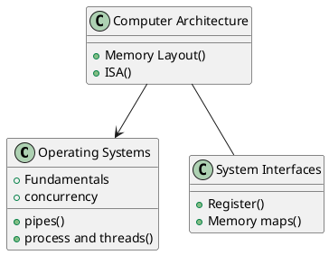

# Chapter 1

```plantuml,format=svg
@startuml


class "Operating Systems" as os {
  + Fundamentals
  + pipes()
  + process and threads()
  + concurrency
}

class "Computer Architecture" as comp_arch {
   + Memory Layout()
   + ISA()
}

class "System Interfaces" as sys_int{
   + Register()
   + Memory maps()
}

comp_arch --> os
comp_arch -- sys_int
@enduml
```
