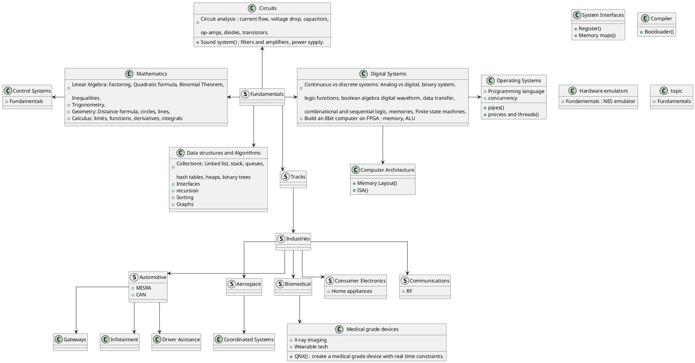

# Roadmap Overview

What is the recommended usage of this roadmap?
1. Complete the Fundamentals, this is knowledge that will be the pillar for anything you may end up working on as an Embedded Developer and even most of it applies to other engineering branches.
2. Select one Track and one Industry that catches your attention and start getting familiarized with the topics inside of both, for example: My goal is to learn about Embedded Software track in the Automotive Industry, If you were to select gateways then you could become proeficient in handling and passing data between two components.